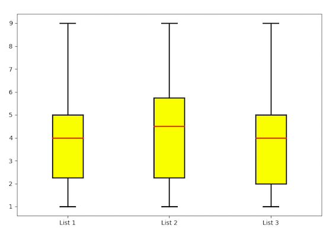

# Python Stats

This collection of programs perform various statistical tasks, including:
* calculating the __variance__ and __standard deviation__ of a set of numbers.
* calculating the __interquartile range__ of a set of numbers.

These are standard statistical tasks, so there are no doubt built-in methods for doing this. However, I want to do my own calculations so that I understand what's going on and will be better placed to assess the results of in-built methods.

---

---

## About the Programs

* __standard_deviation.py__ calculates the standard deviation using basic Python functions.
* __interquartile_range.py__ calculates the interquartile range and other parts of the five-number summary using basic Python functions.
* __standard_deviations_with_packages.py__ refactors __standard_deviation.py__ using the __numpy__ and __scipy__ packages to make for cleaner code and more accurate results.
* __iqr_with_scipy.py__ takes the same functionality from __interquartile_range.py__, but uses __numpy__ and __scipy__ packages allow cleaner code and probably more accurate results.
* __boxplot.py__ takes three lists and plots their five-number summaries in a boxplot diagram.

---

## Packages Used:

The programs use Python 3 along with pip3 for installation. The packages used are:
* numpy
* scipy
* matplotlib

